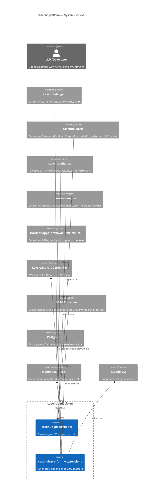
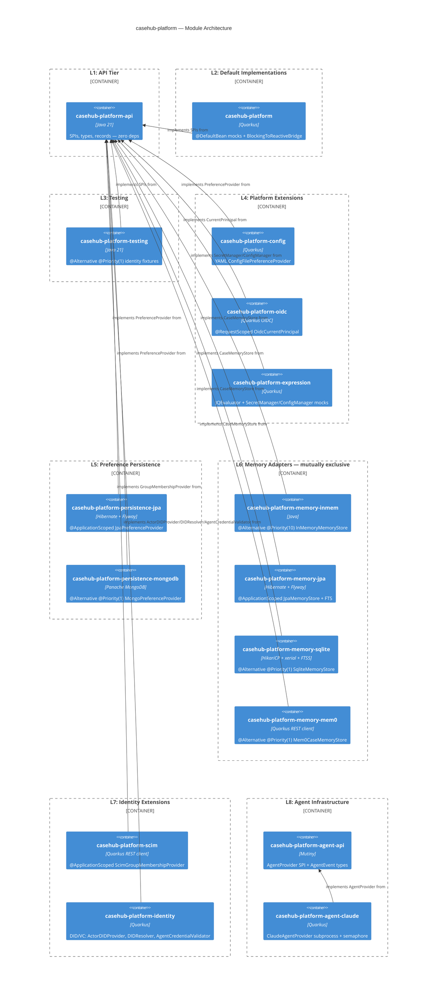

# casehub-platform — ARC42STORIES.MD

**Spec:** Arc42Stories v0.1
**Profile:** CaseHub — Foundation tier
**Profile ref:** `../parent/docs/arc42stories-casehub-profile.md` · fallback: `https://raw.githubusercontent.com/casehubio/parent/main/docs/arc42stories-casehub-profile.md`
**Build position:** First in the foundation stack — no casehubio dependencies. Must publish before ledger, connectors, work, qhorus, eidos, engine.
**Consumed by:** casehub-ledger, casehub-connectors, casehub-work (api), casehub-qhorus, casehub-eidos, casehub-engine, all application-tier harness apps
**Depends on:** None — zero casehubio dependencies. Pure Java APIs + Quarkus extension modules with no upstream casehub deps.

---

## §1 Introduction and Goals

### Description

`casehub-platform` is the zero-dependency foundational SPI layer for the CaseHub ecosystem. It defines shared interfaces and default implementations that all foundation modules and application-tier repos depend on without creating circular dependencies.

Core capabilities: `Path` (hierarchical scope keys for preferences), `PreferenceKey` / `PreferenceProvider` (scoped configuration SPIs), `CurrentPrincipal` (identity context), `ActorType` / `ActorTypeResolver` (actor classification), `GroupMembershipProvider` / `GroupMember` (directory-backed group lookup), `CaseMemoryStore` (semantic cross-case memory SPI), `AgentProvider` (agent execution SPI), `ActorStateContributor` / `ActorStateAccumulator` (actor workload state SPI).

Module structure: `platform-api` (SPIs, zero heavy deps), `platform` (@DefaultBean mocks + reactive bridges), `testing` (@Alternative @Priority(1) fixtures), `config/` (YAML preferences), `oidc/` (OIDC CurrentPrincipal), `expression/` (JQEvaluator), `persistence-jpa/` (JPA PreferenceProvider), `persistence-mongodb/` (MongoDB PreferenceProvider), `memory-inmem/` (volatile), `memory-jpa/` (PostgreSQL + FTS), `memory-sqlite/` (embedded + FTS5), `memory-mem0/` (Mem0 REST + vector), `scim/` (SCIM 2.0 GroupMembershipProvider), `identity/` (DID/VC agent identity), `agent-api/` (AgentProvider SPI), `agent-claude/` (Claude SDK integration).

### Artifact Schema

| Artifact type | Format | Example | Where it lives |
|---|---|---|---|
| Issue | `#NNN` or `casehubio/[repo]#NNN` | `#52`, `casehubio/parent#56` | GitHub Issues |
| Garden entry | `GE-YYYYMMDD-XXXXXX` | `GE-20260521-e39ad1` | `~/.hortora/garden/` |
| Protocol | `PP-YYYYMMDD-XXXXXX` | `PP-20260530-88cdf9` | `casehub-parent/docs/protocols/` |
| ADR | `ADR-NNNN` | `ADR-0007` | `adr/` |
| Blog entry | `YYYY-MM-DD-[initials]NN-title` | `2026-05-19-mdp01-title` | workspace `blog/` |
| Design spec | `YYYY-MM-DD-topic-design` | `2026-05-21-oidc-current-principal-design` | `docs/specs/` |

Foundation tier uses issue refs directly — no improvement log prefix.

### Stakeholders

| Stakeholder | Interest |
|---|---|
| Application-tier harness apps | Consume foundation primitives — preferences, identity, memory, agent execution |
| Platform team | Maintain correctness and backward compatibility of SPIs |
| LLM sessions (Claude) | Navigate architecture and implement extensions confidently |

### Quality Goals

| Goal | Scenario |
|---|---|
| Zero circular deps | casehub-platform must never depend on casehub-ledger, casehub-work, or any other foundation module |
| SPI isolation | platform-api must not expose heavy external SDK types in method signatures |
| Adapter exclusivity | Exactly one memory adapter active per deployment scope — combining any two causes AmbiguousResolutionException |
| Opt-in extensions | Adding an optional module (oidc/, scim/, memory-jpa/) must not affect consumers that don't declare it |

---

## §2 Constraints

### Platform

Java 21 (on Java 26 JVM), Quarkus 3.32.2. Published to GitHub Packages as `io.casehub:casehub-platform:0.2-SNAPSHOT`.

```bash
JAVA_HOME=$(/usr/libexec/java_home -v 26) mvn clean install
```

### Dependencies

Resolved from GitHub Packages: `https://maven.pkg.github.com/casehubio/*`. CI authentication via `GITHUB_TOKEN`. No casehubio module may be a compile or runtime dependency of `casehub-platform-api`.

### Module-tier rules

- `platform-api/` — zero production dependencies. No Quarkus, no JPA, no casehubio imports. Pure Java only.
- `platform/` — Quarkus `@DefaultBean` implementations only. No domain logic.
- Every SPI in `platform-api/` gets a `@DefaultBean` implementation in `platform/`.

---

## §3 Context and Scope



**Boundary rules:** `casehub-platform` owns only the concerns described in §1. Domain logic, business rules, and application-specific workflows belong in application-tier repos. A type or SPI belongs in `platform-api` only if multiple peer repos need it and cannot share it by depending on a single domain `api/` module (`ActorType`, `CurrentPrincipal`, `Path` qualify; `WorkItem`, `LedgerEntry` do not).

See `../parent/docs/PLATFORM.md` Capability Ownership table for the full boundary map.

---

## §4 Solution Strategy

### Core architectural patterns

- **`@DefaultBean` CDI displacement** — every SPI has a mock default; any non-default `@ApplicationScoped` bean on the classpath displaces it automatically with no exclusion config
- **`@Alternative @Priority(N)` ladder** — when multiple implementations compete (e.g. MongoDB vs JPA), the higher priority wins; test overrides land at `@Priority(10+)` to beat all production adapters
- **Optional module activation** — opt-in capabilities (oidc/, scim/, memory-jpa/) activate by classpath presence; removing the dependency reverts to the mock with zero config change
- **Blocking SPI + reactive bridge** — `CaseMemoryStore` is blocking; `BlockingToReactiveBridge` wraps it as `ReactiveCaseMemoryStore @DefaultBean`, so reactive callers need not care which adapter is active
- **Typed preference keys** — `PreferenceKey<T>` carries `defaultValue` and `parser` colocated at key definition, following the Drools `OptionKey<T>` pattern; type-safe, null-free call sites via `getOrDefault(key)`

### Layer taxonomy

| Layer | Module(s) | Responsibility |
|---|---|---|
| L1: API Tier | `platform-api` | Zero-dep Java SPIs, records, enums, types |
| L2: Default Implementations | `platform` | `@DefaultBean` CDI mocks + reactive bridge |
| L3: Testing Infrastructure | `testing` | `@Alternative @Priority(1)` test fixtures |
| L4: Platform Extensions | `config/`, `oidc/`, `expression/` | Opt-in non-mock implementations |
| L5: Preference Persistence | `persistence-jpa/`, `persistence-mongodb/` | Database-backed PreferenceProvider |
| L6: Memory Adapters | `memory-inmem/`, `memory-jpa/`, `memory-sqlite/`, `memory-mem0/` | CaseMemoryStore implementations (mutually exclusive) |
| L7: Identity Extensions | `scim/`, `identity/` | SCIM group membership, DID/VC agent identity |
| L8: Agent Infrastructure | `agent-api/`, `agent-claude/` | AgentProvider SPI + Claude subprocess execution |

### Journey and Chapter sequencing rationale

- C1 before C2: C2's `ConfigFilePreferenceProvider` depends on `PreferenceKey.parser` introduced in C1
- C1 before C3: `OidcCurrentPrincipal` implements `CurrentPrincipal` — the SPI must exist first
- C1 before C4: `ActorTypeResolver` adds a default method to `CurrentPrincipal`
- C3 before C6/C7: `SettingsScope` (carries `tenancyId`) feeds the JPA/MongoDB scope resolution queries
- C8 independent of C12: Memory SPI and SCIM GroupMembershipProvider have no shared dependency; C12 was developed concurrently
- C9/C10/C14 after C8: All three are `CaseMemoryStore` adapter modules — the SPI and contract test must exist (C8) before adapters can be validated
- C11 after C8/C9/C14: Contract hardening requires the adapter implementations to be complete
- C13 after C12: Agent identity module uses SCIM-backed `ActorDIDProvider` — C12's SCIM module must be on the classpath
- C15 independent: `ActorStateContributor` adds types to `platform-api`; no runtime dependency on any prior chapter

---

## §5 Building Block View



---

## §6 Runtime View

### Preference resolution (scope hierarchy)

```mermaid
C4Dynamic
  title Preference resolution — JPA backend, scope hierarchy

  Consumer(caller, "Application code")
  Container(jpaProvider, "JpaPreferenceProvider")
  ContainerDb(db, "platform_preference table")

  Rel(caller, jpaProvider, "resolve(SettingsScope{path, now})")
  Rel(jpaProvider, db, "SELECT WHERE scope IN [ancestors] ORDER BY depth")
  Rel(db, jpaProvider, "rows, child scope wins")
  Rel(jpaProvider, caller, "MapPreferences — key.parse() on typed access")
```

Scope hierarchy: root (`/`) → org (`casehubio`) → app (`casehubio/devtown`) → case-type (`casehubio/devtown/pr-review`). Child overrides parent. `effectiveAt` is ignored — current-only (ADR-0006).

### Memory store + tenant assertion

```mermaid
C4Dynamic
  title CaseMemoryStore.store() — JPA adapter, tenant check

  Consumer(caller, "Application code (injected store)")
  Container(jpaStore, "JpaMemoryStore")
  Container(principal, "CurrentPrincipal (@RequestScoped)")
  ContainerDb(db, "memory_entry table")

  Rel(caller, jpaStore, "store(MemoryInput)")
  Rel(jpaStore, principal, "assertTenant(tenantId, principal)")
  Rel(jpaStore, db, "MemoryEntry.persist() @Transactional(REQUIRED)")
  Rel(jpaStore, caller, "Memory (id, text, domain, timestamps)")
```

`MemoryPermissions.assertTenant()` is a static utility — callable from both blocking and reactive adapter paths. Throws `SecurityException` before any entity reaches the persistence layer.

---

## §7 Deployment View

Published to GitHub Packages. CI: GitHub Actions. No GraalVM native target — foundation modules are library JARs only.

| Module | Scope in consumers | Notes |
|---|---|---|
| `casehub-platform-api` | `compile` | Always — zero-dep, safe for all consumers |
| `casehub-platform` | `compile` | Always — provides @DefaultBean mocks |
| `casehub-platform-testing` | `test` | Identity fixtures for @QuarkusTest |
| `casehub-platform-config` | `compile` (production) | YAML prefs; not on test-only classpaths |
| `casehub-platform-oidc` | `compile` (production) | Displaces mock when quarkus-oidc is wired |
| `casehub-platform-expression` | `compile` | JQEvaluator — safe, no conflict risk |
| `casehub-platform-persistence-jpa` | `compile` + Flyway location | `classpath:db/platform/migration` required |
| `casehub-platform-persistence-mongodb` | `compile` | Beats JPA via `@Alternative @Priority(1)` |
| `casehub-platform-memory-inmem` | `test` (isolation) or `compile` (ephemeral) | Do NOT combine with jpa or sqlite |
| `casehub-platform-memory-jpa` | `compile` + Flyway location | `classpath:db/memory/migration` required |
| `casehub-platform-memory-sqlite` | `compile` | Configure `casehub.memory.sqlite.path` |
| `casehub-platform-memory-mem0` | `compile` | Configure `quarkus.rest-client.mem0.url` + api-key |
| `casehub-platform-scim` | `compile` | Configure SCIM URL + auth |
| `casehub-platform-identity` | `compile` | Configure `casehub.identity.*` |
| `casehub-platform-agent-api` | `compile` | SPI only — no-op default active |
| `casehub-platform-agent-claude` | `compile` | Requires Claude CLI on PATH |

---

## §8 Crosscutting Concepts

### Protocol references

| Concern | Protocol / Reference |
|---|---|
| Module tier structure | `docs/protocols/universal/module-tier-structure.md` |
| Flyway version allocation | `docs/protocols/casehub/flyway-version-range-allocation.md` |
| Flyway migration rules | `docs/protocols/universal/flyway-migration-rules.md` |
| CDI displacement (`@DefaultBean`) | `docs/protocols/casehub/alternative-extension-patterns.md` |
| SPI adapter placement | `docs/protocols/universal/spi-adapter-module-placement.md` |
| SPI return type change propagation | Protocol `PP-20260530-88cdf9` |
| CurrentPrincipal boolean delegation | Protocol `PP-20260522-359dfc` |
| Capability ownership | `../parent/docs/PLATFORM.md` Capability Ownership table |
| Architectural patterns | `../parent/docs/ARCHITECTURE.md` |

### Anti-patterns

**Symptom:** `AmbiguousResolutionException` in `@QuarkusTest` — CDI cannot choose between two `CaseMemoryStore` beans.
**Cause:** Two memory adapter modules declared on the same classpath scope (e.g. `memory-jpa` compile + `memory-inmem` test). Both have equal or ambiguous CDI priority.
**Fix:** `memory-inmem` is at `@Alternative @Priority(10)` — the test-override tier. Declare production adapters at `@Priority(1–9)`. Never combine `memory-inmem` with `memory-jpa` or `memory-sqlite` in the same scope.

---

**Symptom:** `@QuarkusTest` passes with clean build; downstream consumer fails on first clean build with compilation error after an SPI return type change.
**Cause:** Incremental Maven build satisfies classpath from stale `.class` files. Every implementation in the repo changes in the same commit when an SPI return type changes; incremental builds miss the stale `.class`.
**Fix:** After any SPI return type change, run `mvn clean install` (not `mvn install`) before committing. Audit all in-repo implementations — not just the primary one — in the same diff. Protocol `PP-20260530-88cdf9` covers this.

---

**Symptom:** `quarkus-rest` (or another Quarkus runtime) appears as a compile dependency in `platform-api` or `platform`.
**Cause:** A developer added a Quarkus runtime to get a convenience API (e.g. `@Provider`, `@Path`). This puts Quarkus on the transitive classpath of every consumer of `casehub-platform-api`, breaking the zero-dep contract.
**Fix:** Use Jakarta EE API jars (`jakarta.ws.rs-api`, `jakarta.inject-api`) in provided scope. Never add Quarkus runtime to `platform-api`. If Quarkus is needed for an implementation, it belongs in a separate optional module.

---

**Symptom:** `ContextNotActiveException` when `CaseMemoryStore.store()` is called from a CDI `@ObservesAsync` observer.
**Cause:** Async CDI observers run on a thread pool where `@RequestScoped` context is not propagated by default. `JpaMemoryStore` (and any store that injects `@RequestScoped CurrentPrincipal`) requires an active request context.
**Fix:** Inject and call `store()` directly from your `@ApplicationScoped` or `@RequestScoped` bean. Do not emit a CDI event and observe it asynchronously to trigger `store()` — this is the exact anti-pattern `@ObservesAsync` makes invisible. `@Observes` (synchronous) is acceptable but tightly couples the caller.

---

**Symptom:** `casehub.memory.sqlite.path` is set; `memory-sqlite` is on classpath; startup fails with a connection pool or WAL mode error when running `@QuarkusTest`.
**Cause:** SQLite in-memory mode (`:memory:`) does not support WAL mode, and a pool size greater than one creates isolated per-connection databases.
**Fix:** Set `casehub.memory.sqlite.path=:memory:` in test `application.properties`. The module detects this value at startup, skips WAL, and forces pool size to 1. Each test gets a clean slate after `eraseEntity()` in `@AfterEach`.

---

**Symptom:** Data access code uses `if (multiTenantEnabled) { filterByTenancyId(principal.tenancyId()); }` — tenancy filter is conditional.
**Cause:** Multi-tenancy treated as a deployment flag rather than a structural property of the identity model.
**Fix:** Tenancy filtering is unconditional. In single-tenant deployments, every principal returns `TenancyConstants.DEFAULT_TENANT_ID` — the filter always matches, the predicate always runs. Never make the filter conditional. Protocol `PP-20260520-439daf`.

---

**Symptom:** Boot fails with `SRCFG00050: does not map to any root` for a config key that another bean reads via `@ConfigProperty`.
**Cause:** A `@ConfigMapping(prefix = "casehub.platform.scim")` interface claims exclusive ownership of its prefix. Any key under that prefix not declared as a method in the interface is rejected in strict mode — even if another bean reads it via `@ConfigProperty`. The two mechanisms conflict on the same prefix.
**Fix:** Move ALL config keys under the prefix into the `@ConfigMapping` interface. Remove any `@ConfigProperty` injections for keys under that prefix from other beans. One interface owns one prefix.

---

## §9 Journeys and Chapters

### §9.1 Journey Overview

| Journey | Description | Chapters | Status |
|---|---|---|---|
| J1: Configuration & Identity Foundation | Zero-dep SPI layer: preferences, identity, expression evaluation — all non-memory, non-agent capabilities | C1–C7 | ✅ Complete |
| J2: Semantic Memory | Queryable, permission-aware cross-case agent memory with four adapter options | C8–C11 | ✅ Complete |
| J3: Group & Agent Identity | SCIM directory membership, DID/VC agent identity binding, Claude subprocess execution | C12–C15 | ✅ Complete |

### §9.2 Chapter Index

```mermaid
flowchart LR
  C1["C1: Core SPIs\nL1+L2+L3"] --> C2["C2: YAML Config\n+L4"]
  C2 --> C3["C3: OIDC+Tenancy\n+L4"]
  C3 --> C4["C4: ActorType\nL1"]
  C4 --> C5["C5: JQ Expr\n+L4"]
  C5 --> C6["C6: JPA Prefs\n+L5"]
  C6 --> C7["C7: MongoDB Prefs\n+L5"]
  C7 --> C8["C8: Memory SPI\n+L6"]
  C8 --> C12["C12: SCIM\n+L7"]
  C8 --> C9["C9: SQLite\nL6"]
  C9 --> C10["C10: Mem0\nL6"]
  C10 --> C11["C11: Hardening\nL6"]
  C12 --> C13["C13: Agent ID\n+L7"]
  C13 --> C14["C14: Agent SPI\n+L8"]
  C14 --> C15["C15: ActorState\nL1"]

  style C1 fill:#90EE90,color:#000
  style C2 fill:#90EE90,color:#000
  style C3 fill:#90EE90,color:#000
  style C4 fill:#90EE90,color:#000
  style C5 fill:#90EE90,color:#000
  style C6 fill:#90EE90,color:#000
  style C7 fill:#90EE90,color:#000
  style C8 fill:#90EE90,color:#000
  style C9 fill:#90EE90,color:#000
  style C10 fill:#90EE90,color:#000
  style C11 fill:#90EE90,color:#000
  style C12 fill:#90EE90,color:#000
  style C13 fill:#90EE90,color:#000
  style C14 fill:#90EE90,color:#000
  style C15 fill:#90EE90,color:#000
```



| # | Chapter | Journey | Layers touched | Status |
|---|---|---|---|---|
| 1 | Core SPIs baseline | J1 | L1, L2, L3 | ✅ |
| 2 | YAML Config Provider | J1 | +L4 | ✅ |
| 3 | OIDC + Tenancy | J1 | +L4 | ✅ |
| 4 | ActorType migration | J1 | L1 | ✅ |
| 5 | JQ Expression Evaluator | J1 | +L4 | ✅ |
| 6 | JPA Preferences Backend | J1 | +L5 | ✅ |
| 7 | MongoDB Preferences Backend | J1 | +L5 | ✅ |
| 8 | Memory SPI + InMem + JPA adapters | J2 | +L6 | ✅ |
| 9 | SQLite Durable Memory | J2 | L6 | ✅ |
| 10 | Mem0 Vector Memory | J2 | L6 | ✅ |
| 11 | Memory Contract Hardening | J2 | L6 | ✅ |
| 12 | SCIM GroupMembershipProvider | J3 | +L7 | ✅ |
| 13 | Agent Identity — DID/VC | J3 | +L7 | ✅ |
| 14 | Agent SPI — Claude | J3 | +L8 | ✅ |
| 15 | ActorState SPI | J3 | L1 | ✅ |

**Layer × Chapter matrix**

| Layer | C1 | C2 | C3 | C4 | C5 | C6 | C7 | C8 | C9 | C10 | C11 | C12 | C13 | C14 | C15 |
|---|---|---|---|---|---|---|---|---|---|---|---|---|---|---|---|
| L1: API Tier | High | — | Med | Med | Low | Low | Low | High | Low | Low | Low | Low | Med | Low | Low |
| L2: Default Impls | High | Low | Low | Low | Low | — | — | Med | — | — | Low | Low | — | Low | — |
| L3: Testing | High | — | — | — | — | — | — | Med | Med | Med | Low | Low | — | — | — |
| L4: Platform Ext | — | High | High | — | High | — | — | — | — | — | — | — | — | — | — |
| L5: Pref Persist | — | — | — | — | — | High | High | — | — | — | — | — | — | — | — |
| L6: Memory Adapt | — | — | — | — | — | — | — | High | High | High | Med | — | — | — | — |
| L7: Identity Ext | — | — | — | — | — | — | — | — | — | — | — | High | High | — | — |
| L8: Agent Infra | — | — | — | — | — | — | — | — | — | — | — | — | — | High | — |

**Sequencing rationale:**

- C1 before all: establishes `platform-api` SPIs that every subsequent module implements
- C2 before C6/C7: `PreferenceKey.parser` (C1) enables YAML-to-typed-value conversion — both subsequent preference backends depend on the same mechanism
- C3 after C1: `OidcCurrentPrincipal` is an implementation of `CurrentPrincipal`; also adds `tenancyId()`/`isCrossTenantAdmin()` abstract methods to the SPI (breaking change requiring all implementations to update)
- C4 after C1: `ActorTypeResolver` adds a default method to `CurrentPrincipal`
- C8 before C9, C10, C11: `CaseMemoryStore` SPI and `CaseMemoryStoreContractTest` must exist before adapter implementations can be validated
- C12 before C13: `identity/` module uses `ScimActorDIDProvider` which depends on the SCIM client from C12
- C8 and C12 independent: memory and SCIM have no shared runtime dependency; developed concurrently

### §9.3 Chapter Entries

#### C1 — Core SPIs Baseline

**Journey:** J1 | **Sequence:** 1 of 15 | **Status:** ✅
**Delivered:** 2026-05-18/19 | **Issues:** #1, #2 | **Blog:** `blog/2026-05-19-mdp01-laying-platform-foundation.md`

**What this delivers**
Consumers can declare a `@ConfigProperty`-backed `PreferenceKey<T>`, resolve it from `MockPreferenceProvider`, and inject `CurrentPrincipal` and `GroupMembershipProvider` in any Quarkus application. Test suites can substitute `FixedCurrentPrincipal` and `InMemoryGroupMembershipProvider` without a running auth server. The typed key pattern (`PreferenceKey.parser`) eliminates the need for an in-memory fixture for preference testing.

**Accountability gaps closed**
- Typed preference lookup without null risk → L1 (`PreferenceKey.getOrDefault`)
- Identity context injection → L2 (`MockCurrentPrincipal @DefaultBean`)
- Test identity substitution → L3 (`FixedCurrentPrincipal @Alternative @Priority(1)`)

**Layer Impact**
| Layer | Delta |
|---|---|
| L1: API Tier | High |
| L2: Default Implementations | High |
| L3: Testing Infrastructure | High |

---

#### C2 — YAML Preferences Provider

**Journey:** J1 | **Sequence:** 2 of 15 | **Status:** ✅
**Delivered:** 2026-05-20 | **Issues:** #2 | **Blog:** `blog/2026-05-20-mdp01-preferences-drools-cascade.md`

**What this delivers**
Harness apps can ship a YAML preferences file, and `ConfigFilePreferenceProvider` resolves scoped values at startup — no database required. SmallRye Config overrides (`application.properties`) still win above the YAML layer, so tests continue to use property file overrides without structural change. REST endpoints can accept `Path` as a `@PathParam` or `@QueryParam` via `PathParamConverter`.

**Accountability gaps closed**
- File-based preferences with scope hierarchy → L4 (`ConfigFilePreferenceProvider`)
- REST Path parameter binding → L2 (`PathParamConverter @Provider`)

**Layer Impact**
| Layer | Delta |
|---|---|
| L4: Platform Extensions | High |
| L2: Default Implementations | Low |

---

#### C3 — OIDC CurrentPrincipal + Tenancy

**Journey:** J1 | **Sequence:** 3 of 15 | **Status:** ✅
**Delivered:** 2026-05-21 | **Issues:** #3, #16, #17 | **Blog:** `blog/2026-05-21-mdp02-oidc-optional-module.md`, `blog/2026-05-21-mdp01-tenancy-id-before-the-fields.md`

**What this delivers**
Consumers that add `casehub-platform-oidc` get JWT-backed identity context with `tenancyId` and `crossTenantAdmin` extracted from standard claims. Removing the dependency reverts to the mock — no exclusion config. The `tenancyId()` and `isCrossTenantAdmin()` methods are now abstract on `CurrentPrincipal`, forcing every implementation to declare a tenancy position at compile time. `TenancyConstants` ships as a separate utility class (`DEFAULT_TENANT_ID`, `PLATFORM_TENANT_ID`) so data-access classes can import the sentinels without importing the identity SPI.

**Accountability gaps closed**
- Production identity from JWT → L4 (`OidcCurrentPrincipal @RequestScoped`)
- Tenancy isolation — every actor must declare a tenancy → L1 (`CurrentPrincipal` abstract methods)
- Sentinel values accessible without identity SPI import → L1 (`TenancyConstants`)

**Layer Impact**
| Layer | Delta |
|---|---|
| L4: Platform Extensions | High |
| L1: API Tier | Medium |

---

#### C4 — ActorType Migration

**Journey:** J1 | **Sequence:** 4 of 15 | **Status:** ✅
**Delivered:** 2026-05-22 | **Issues:** #22 | **Blog:** `blog/2026-05-22-mdp01-moving-actortype-upstream.md`

**What this delivers**
`CurrentPrincipal.actorType()` is available as a default method without any ledger dependency. Foundation-tier repos that need actor classification (`HUMAN / AGENT / SYSTEM`) no longer require a transitive dependency on `casehub-ledger-api`. The seven-rule resolver (`ActorTypeResolver`) handles `system:*`, versioned persona format (`word:word@version`), and A2A role values correctly.

**Accountability gaps closed**
- Actor classification without ledger dependency → L1 (`ActorType`, `ActorTypeResolver` in `platform-api`)

**Layer Impact**
| Layer | Delta |
|---|---|
| L1: API Tier | Medium |
| L2: Default Implementations | Low |

---

#### C5 — JQ Expression Evaluator

**Journey:** J1 | **Sequence:** 5 of 15 | **Status:** ✅
**Delivered:** 2026-05-22 | **Issues:** engine#319 | **Blog:** `blog/2026-05-22-mdp02-jq-moves-to-platform.md`

**What this delivers**
Foundation-tier repos (`casehub-work`, `casehub-qhorus`) can evaluate JQ expressions against JSON without depending on the Orchestration tier. `JQEvaluator` compiles and caches `JsonQuery` instances via `ConcurrentHashMap` and supports `$secret` and `$config` scope injection. `MockSecretManager` and `MockConfigManager` ship in `expression/` itself, making the module self-contained.

**Accountability gaps closed**
- JQ evaluation without Orchestration tier dependency → L4 (`JQEvaluator @ApplicationScoped` in `expression/`)

**Layer Impact**
| Layer | Delta |
|---|---|
| L4: Platform Extensions | High |

---

#### C6 — JPA Preferences Backend

**Journey:** J1 | **Sequence:** 6 of 15 | **Status:** ✅
**Delivered:** 2026-05-22 | **Issues:** #6 | **Blog:** `blog/2026-05-22-mdp03-preferences-meet-database.md`

**What this delivers**
Preference values survive restarts and can be updated without a redeployment. Scope hierarchy resolution uses a single `IN`-clause query — no N+1. Adding `casehub-platform-persistence-jpa` to a consumer's classpath displaces the mock automatically; removing it reverts to YAML or mock.

**Accountability gaps closed**
- Durable scoped preferences → L5 (`JpaPreferenceProvider @ApplicationScoped`)

**Layer Impact**
| Layer | Delta |
|---|---|
| L5: Preference Persistence | High |

---

#### C7 — MongoDB Preferences Backend

**Journey:** J1 | **Sequence:** 7 of 15 | **Status:** ✅
**Delivered:** 2026-05-22 | **Issues:** — | **Blog:** `blog/2026-05-22-mdp06-mongodb-preferences-missing-rung.md`

**What this delivers**
Consumers co-deploying Postgres JPA and MongoDB can use MongoDB as the preference store without configuration — `@Alternative @Priority(1)` beats `@ApplicationScoped` JPA automatically. No Flyway; a startup bean creates the scope index idempotently. The compound `_id` key (`scope|namespace|name|subKey`) provides free upsert semantics without a separate unique index.

**Accountability gaps closed**
- MongoDB-native preferences without Flyway → L5 (`MongoPreferenceProvider @Alternative @Priority(1)`)

**Layer Impact**
| Layer | Delta |
|---|---|
| L5: Preference Persistence | High |

---

#### C8 — Memory SPI + InMem + JPA Adapters

**Journey:** J2 | **Sequence:** 8 of 15 | **Status:** ✅
**Delivered:** 2026-05-28 to 2026-06-01 | **Issues:** #27, #32, #36, #48 | **Blog:** `blog/2026-05-28-mdp01-teaching-platform-to-remember.md`

**What this delivers**
Applications can store and query agent memories that persist across case boundaries. `CaseMemoryStore.store()` is append-only; `query()` supports multi-entity fan-out, `CHRONOLOGICAL` and `RELEVANCE` ordering, and `since` filtering. `assertTenant()` enforces per-store tenant isolation before any entity reaches the persistence layer. The `BlockingToReactiveBridge` wraps any blocking adapter as `ReactiveCaseMemoryStore @DefaultBean`, so reactive callers need no adapter-specific code.

**Accountability gaps closed**
- Cross-case agent memory — before: every case starts cold, no shared knowledge → L6 (`CaseMemoryStore` SPI + `InMemoryMemoryStore`, `JpaMemoryStore`)
- Reactive memory access without adapter-specific code → L2 (`BlockingToReactiveBridge`)
- Tenant assertion before persistence — GDPR-adjacent correctness → L1 (`MemoryPermissions.assertTenant`)

**Layer Impact**
| Layer | Delta |
|---|---|
| L6: Memory Adapters | High |
| L1: API Tier | High |
| L2: Default Implementations | Medium |
| L3: Testing Infrastructure | Medium |

---

#### C9 — SQLite Durable Memory

**Journey:** J2 | **Sequence:** 9 of 15 | **Status:** ✅
**Delivered:** 2026-05-31 | **Issues:** #37 | **Blog:** `blog/2026-05-31-mdp01-durable-memory-no-server.md`

**What this delivers**
Single-process deployments and local installs get durable agent memory without a database server. The module manages HikariCP directly — no Quarkus datasource block, no Flyway configuration. `casehub.memory.sqlite.path=:memory:` gives isolated in-memory mode for `@QuarkusTest`. FTS5 virtual table with three triggers provides relevance ranking.

**Accountability gaps closed**
- Durable memory without a server → L6 (`SqliteMemoryStore @Alternative @Priority(1)`)

**Layer Impact**
| Layer | Delta |
|---|---|
| L6: Memory Adapters | High |
| L3: Testing Infrastructure | Medium |

---

#### C10 — Mem0 Vector Memory

**Journey:** J2 | **Sequence:** 10 of 15 | **Status:** ✅
**Delivered:** 2026-06-04 | **Issues:** #33 | **Blog:** `blog/2026-06-04-mdp01-mem0-adapter.md`

**What this delivers**
Agent memories are stored with vector embeddings in Mem0 OSS, enabling semantic similarity search (`RELEVANCE` order). `infer:false` disables LLM rewriting, preserving verbatim text and maintaining the 1:1 store→memoryId contract. Tenant isolation uses compound `user_id={tenantId}::{entityId}` (Mem0 OSS has no `app_id`). `GET /memories` is unbounded — limit is applied client-side.

**Accountability gaps closed**
- Semantic similarity search across case memories → L6 (`Mem0CaseMemoryStore @Alternative @Priority(1)`)

**Layer Impact**
| Layer | Delta |
|---|---|
| L6: Memory Adapters | High |

---

#### C11 — Memory Contract Hardening

**Journey:** J2 | **Sequence:** 11 of 15 | **Status:** ✅
**Delivered:** 2026-06-05 | **Issues:** #39, #49 | **Blog:** `blog/2026-06-05-mdp01-storeall-contract.md`

**What this delivers**
`JpaMemoryStore.storeAll()` executes in a single transaction — a mixed-tenant batch (item 0 valid, item 1 invalid) leaves zero entries rather than a partial write. `InMemoryMemoryStore` moves to `@Priority(10)` — the test-override tier — eliminating `AmbiguousResolutionException` when a production adapter (compile scope) and memory-inmem (test scope) coexist in `@QuarkusTest`.

**Accountability gaps closed**
- Atomic multi-item writes — no partial persistence on mixed-tenant batch → L6 (`JpaMemoryStore.storeAll`)
- Test-override CDI tier — production adapter + test fixture coexist without conflict → L6 (`InMemoryMemoryStore @Priority(10)`)

**Layer Impact**
| Layer | Delta |
|---|---|
| L6: Memory Adapters | Medium |
| L2: Default Implementations | Low |

---

#### C12 — SCIM GroupMembershipProvider

**Journey:** J3 | **Sequence:** 12 of 15 | **Status:** ✅
**Delivered:** 2026-05-30 to 2026-06-01 | **Issues:** #45, #47 | **Blog:** `blog/2026-05-30-mdp01-asking-directories-whos-in-the-group.md`

**What this delivers**
The `GroupMembershipProvider` answers the inverse membership query ("who is in group X?") from a real SCIM 2.0 directory — Keycloak, Okta, Azure AD, JumpCloud. `membersOf()` returns `Set<GroupMember>` where `actorId` maps to the OIDC `sub` claim (stable identity key). Pagination is automatic: if the member count meets the page-size threshold, a second paginated loop fetches all members. `@CacheResult` prevents per-routing-decision SCIM round-trips.

**Accountability gaps closed**
- Directory-backed inverse membership — before: `membersOf()` always returned empty set → L7 (`ScimGroupMembershipProvider`)
- Stable identity key in group results — `actorId` from SCIM `value`, not `display` → L1 (`GroupMember` record)

**Layer Impact**
| Layer | Delta |
|---|---|
| L7: Identity Extensions | High |
| L1: API Tier | Low |
| L2: Default Implementations | Low |
| L3: Testing Infrastructure | Low |

---

#### C13 — Agent Identity (DID/VC)

**Journey:** J3 | **Sequence:** 13 of 15 | **Status:** ✅
**Delivered:** 2026-06-02 | **Issues:** #52, #53, #54 | **Blog:** `blog/2026-06-01-mdp03-the-permission-layer.md`

**What this delivers**
Agent actors can prove their identity via DID (did:key, did:web) and verifiable credentials. `AgentIdentityVerificationService` validates the full chain: DID resolution → key extraction → signature verification → credential validation. CDI events (`AgentIdentityValidatedEvent`, `AgentIdentityViolationEvent`) let observers react to binding outcomes without coupling to the identity module. `ScimActorDIDProvider` resolves agent DIDs from the SCIM directory.

**Accountability gaps closed**
- Cryptographic agent identity binding → L7 (`identity/` module — `AgentIdentityVerificationService`)

**Layer Impact**
| Layer | Delta |
|---|---|
| L7: Identity Extensions | High |
| L1: API Tier | Medium |

---

#### C14 — Agent SPI (Claude)

**Journey:** J3 | **Sequence:** 14 of 15 | **Status:** ✅
**Delivered:** 2026-06-03 | **Issues:** #55 | **Blog:** `blog/2026-06-03-mdp01-shipping-platform-agent.md`

**What this delivers**
Application code can submit a prompt to a Claude subprocess and receive a `Multi<AgentEvent>` event stream — without knowing which agent implementation is active. `ClaudeAgentClient @Startup` probes for the Claude CLI at boot; a semaphore enforces `AgentSessionConfig.maxConcurrentSessions`. A scheduled `ScheduledExecutorService` enforces the wall-clock timeout via subprocess close. `NoOpAgentProvider @DefaultBean` emits a WARN per invocation so misconfigured dev environments fail loudly.

**Accountability gaps closed**
- Agent execution without implementation coupling → L8 (`AgentProvider` SPI in `agent-api/`)
- Claude subprocess integration — concurrent-session control, wall-clock timeout → L8 (`agent-claude/`)

**Layer Impact**
| Layer | Delta |
|---|---|
| L8: Agent Infrastructure | High |
| L2: Default Implementations | Low |

---

#### C15 — ActorState SPI

**Journey:** J3 | **Sequence:** 15 of 15 | **Status:** ✅
**Delivered:** 2026-06-03 | **Issues:** casehubio/parent#56 | **Blog:** —

**What this delivers**
`ActorStateContributor` implementations registered across the platform and domain modules can contribute their slice of actor workload data — active cases, open WorkItems, open obligations — to a unified `ActorStateAccumulator`. Aggregators call contributors concurrently; no contributor sees another's data. The SPI is in `platform-api` (zero deps) so any foundation or application module can contribute without an orchestration dependency.

**Accountability gaps closed**
- Actor workload state aggregation across modules → L1 (`ActorStateContributor`, `ActorStateAccumulator`)

**Layer Impact**
| Layer | Delta |
|---|---|
| L1: API Tier | Low |

---

### §9.4 Layer Entries

#### Layer — L1: API Tier

**Participates in chapters:** C1, C2, C3, C4, C5, C6, C7, C8, C9, C10, C11, C12, C13, C14, C15
**Architectural patterns:** SPI (Service Provider Interface), Typed key with colocated parser (Drools OptionKey<T>)
**Key protocols:** `docs/protocols/universal/module-tier-structure.md`, `docs/protocols/casehub/platform-spi-contract.md`
**Issues:** #1, #2, #22, #27, #45, #52, casehubio/parent#56
**Navigation:** `git log --grep="#27\|#22\|#45\|#52" --oneline`
**Blog:** `blog/2026-05-19-mdp01-laying-platform-foundation.md`, `blog/2026-05-28-mdp01-teaching-platform-to-remember.md`
**Completed:** 2026-06-03

#### What it adds

**Before:** No shared Java interfaces — each consuming repo defined its own identity and configuration primitives, creating incompatible types across the stack.
**After:** `platform-api` owns every foundational SPI: `Path`, `PreferenceKey<T>` / `PreferenceProvider`, `CurrentPrincipal`, `ActorType`, `GroupMembershipProvider` / `GroupMember`, `CaseMemoryStore`, `AgentProvider`, `ActorStateContributor` / `ActorStateAccumulator`.

What this layer adds:
- **Typed preference keys** — `PreferenceKey<T>` carries `defaultValue` and `Function<String,T> parser`; `getOrDefault(key)` is null-free at every call site
- **Identity primitives** — `CurrentPrincipal` abstracts actorId, groups, tenancyId, actorType; `ActorType` classifies HUMAN/AGENT/SYSTEM without a ledger dependency
- **Memory SPI** — `CaseMemoryStore` defines `store`, `query`, `eraseById`, `eraseEntity`, `storeAll`; `MemoryPermissions.assertTenant` is a static utility callable from both blocking and reactive paths
- **Agent SPI** — `AgentProvider` returns a `Multi<AgentEvent>` stream; `AgentSessionConfig` carries concurrency and timeout constraints

Not closed here: L2 (mock implementations), L4–L8 (concrete adapters).

#### Accountability gaps closed

| Gap | What breaks without it | Closed by |
|---|---|---|
| Cross-repo type compatibility | Each repo defines its own `ActorType` enum — ledger and engine disagree | `ActorType` in `platform-api` |
| Null-free preference access | Call sites null-check manually; inconsistent defaults | `PreferenceKey.getOrDefault` |
| Tenant-isolated memory | Any actor can store/read any tenant's memories | `MemoryPermissions.assertTenant` |

#### Key files

- `platform-api/src/main/java/io/casehub/platform/api/path/Path.java` — hierarchical scope key; `of(String...)` for explicit segments, `parse(String)` for raw input (ADR-0001)
- `platform-api/src/main/java/io/casehub/platform/api/preferences/PreferenceKey.java` — typed key with `defaultValue` and `parser`; use `qualifiedName()` as map key, never `equals()` (ADR-0002)
- `platform-api/src/main/java/io/casehub/platform/api/preferences/PreferenceProvider.java` — `get(key)` returns null on absence; `getOrDefault(key)` applies key default (ADR-0003)
- `platform-api/src/main/java/io/casehub/platform/api/identity/CurrentPrincipal.java` — `actorId()`, `groups()`, `tenancyId()`, `isCrossTenantAdmin()` abstract; `actorType()`, `isSystem()` delegate to `ActorTypeResolver`
- `platform-api/src/main/java/io/casehub/platform/api/identity/ActorType.java` — enum HUMAN / AGENT / SYSTEM
- `platform-api/src/main/java/io/casehub/platform/api/identity/ActorTypeResolver.java` — seven-rule priority chain; `system:*` prefix, versioned persona `word:word@version`, A2A roles
- `platform-api/src/main/java/io/casehub/platform/api/identity/GroupMembershipProvider.java` — `membersOf(groupName)` returns `Set<GroupMember>`
- `platform-api/src/main/java/io/casehub/platform/api/identity/GroupMember.java` — record: `actorId` (SCIM `value` = OIDC `sub`, stable), `displayName` (never use as routing key)
- `platform-api/src/main/java/io/casehub/platform/api/identity/TenancyConstants.java` — `DEFAULT_TENANT_ID`, `PLATFORM_TENANT_ID` sentinels
- `platform-api/src/main/java/io/casehub/platform/api/memory/CaseMemoryStore.java` — blocking SPI; `store()` is append-only; `eraseById()` and `eraseEntity()` defaults throw (not silent no-ops)
- `platform-api/src/main/java/io/casehub/platform/api/memory/MemoryDomain.java` — record wrapping domain name; strict equality isolation — `query.domain()` must exactly equal stored domain tag
- `platform-api/src/main/java/io/casehub/platform/api/memory/MemoryPermissions.java` — static `assertTenant(tenantId, CurrentPrincipal)` — must be static to be callable from reactive-only adapters
- `platform-api/src/main/java/io/casehub/platform/api/memory/MemoryQuery.java` — `entityIds: List<String>` (evolved from single `entityId` in #48), `MemoryOrder`, fluent `with*` API; `MAX_ENTITY_IDS=25`
- `platform-api/src/main/java/io/casehub/platform/api/memory/MemoryAttributeKeys.java` — reserved cross-domain attribute keys (e.g. `CONFIDENCE`, `SOURCE`) + `formatConfidence(double)` / `parseConfidence(String)` helpers
- `platform-api/src/main/java/io/casehub/platform/api/actor/ActorStateContributor.java` — SPI: `contribute(actorId, ActorStateAccumulator)` — `@ApplicationScoped`
- `platform-api/src/main/java/io/casehub/platform/api/actor/ActorStateAccumulator.java` — visitor passed to each contributor; accumulates active-cases, open-WorkItems, open-obligation slices

#### Key wiring

**`PreferenceKey<T>` uses `qualifiedName()` as map key, not `equals()`.** `PreferenceKey` is a record with a `Function<String,T>` component. Java records derive `equals()`/`hashCode()` from all components; `Function` instances only have identity equality. Two separately-constructed keys with the same namespace and name are not `equals()`. Map lookups by `PreferenceKey` object silently miss.

**`tenancyId()` and `isCrossTenantAdmin()` are abstract on `CurrentPrincipal`.** Not default methods — every implementor is forced at compile time to declare a tenancy position. Single-tenant deployments return `TenancyConstants.DEFAULT_TENANT_ID`; OIDC implementations read a required JWT claim named `tenancyId`.

**`CaseMemoryStore.eraseById()` default throws `UnsupportedOperationException`.** A silent success on an erasure default is a false GDPR compliance signal. Any adapter that does not implement erasure must declare that explicitly, not succeed silently.

**`isSystem()` must delegate to `actorType() == ActorType.SYSTEM`.** An exact-match `"system".equals(actorId())` check contradicts the resolver, which matches the full `system:*` namespace. For `system:scheduler`, `actorType()` returns SYSTEM but the exact match returns false — two methods on the same interface giving contradictory answers. Protocol `PP-20260522-359dfc` captures this.

**`Path.root()` returns a singleton, not a new instance.** `Path.root()` is called on every `WorkItem` with no assigned scope. The implementation caches a static `ROOT` constant and returns it; `assertSame(Path.root(), Path.root())` must pass. A fresh-allocation implementation wastes objects on every call.

**`Path.parent()` returns null for single-segment paths, not for root.** The documented contract is "returns null if root OR single-segment path." Both zero-segment and one-segment paths return null from `parent()`. Consumers building a scope ancestor list via parent-walking will stop at the single-segment — they never reach the zero-segment root. Preference resolution consumers must explicitly prepend root after the walk: `if (path.depth() > 0) { ancestors.add(0, Path.root().value()); }`. See root-scope gotcha in L5.

**`@ActivateRequestContext` required before accessing `CurrentPrincipal` in reactive pipelines.** `MockCurrentPrincipal` and `OidcCurrentPrincipal` are `@ApplicationScoped` / `@RequestScoped` respectively. Reactive handlers (Vert.x, Mutiny pipelines) do not automatically have a CDI request context. Without `@ActivateRequestContext` on the reactive subscriber or the enclosing method, `CurrentPrincipal` injection may return a proxy with no underlying context, causing `ContextNotActiveException`.

**`roles()` delegates to `groups()` — groups-as-roles contract.** `CurrentPrincipal.roles()` is a default method that returns the groups set, so `@RolesAllowed("reviewers")` works directly with CaseHub group names without additional bridge code. `SecurityIdentityAugmentor` implementations for `GroupMembershipProvider` should augment `SecurityIdentity.getRoles()` with CaseHub group memberships for this to function transparently.

#### Architectural decisions

**Why `Path.of(String...)` and `Path.parse(String)` are separate:** Construction and parsing are different operations with different responsibility for segment validation. `of(String...)` trusts the caller; `parse(String)` applies the configured `PathParser` strategy. Separating them prevents the round-trip mutation a single `of(String)` with implicit parsing would produce. ADR-0001.

**Why `ActorType` is in `platform-api`, not `casehub-ledger-api`:** Actor classification is an identity concern. `CurrentPrincipal.actorType()` must be expressible without a ledger dependency — `platform-api` is zero-dependency and adding `casehub-ledger-api` would break the tier model. ADR-0005.

**Why `MemoryPermissions.assertTenant` is static:** Reactive-only `CaseMemoryStore` adapters (those implementing `ReactiveCaseMemoryStore` directly, without going through `BlockingToReactiveBridge`) have no reference to the blocking SPI instance. A `default` method on `CaseMemoryStore` is unreachable from those adapters. A static utility is callable from both paths.

#### Pattern introduced

Typed-key SPI — every configuration concern is expressed as a `PreferenceKey<T>` with colocated default and parser; backends implement one interface; call sites are null-free via `getOrDefault`.

#### Pattern anchor

`platform-api/src/main/java/io/casehub/platform/api/preferences/PreferenceKey.java` — constructor and `parse()` method.

#### Gotchas

**Symptom:** `key.equals(otherKey)` returns false even when namespace and name match.
**Cause:** `PreferenceKey` is a record; `Function` components use identity equality. Two key objects created separately are never `equals()`.
**Fix:** Use `key.qualifiedName()` (returns `"namespace.name"`) as map keys and for equality checks. Never use `PreferenceKey` objects as map keys.

**Symptom:** `MemoryAttributeKeys.formatConfidence(0.87)` returns `"0,8700"` on non-English JVMs; `parseConfidence` then throws.
**Cause:** `String.format("%.4f", v)` uses the JVM default locale. German and French locales use comma as decimal separator. English-locale CI passes cleanly; production breaks silently.
**Fix:** `String.format(Locale.ROOT, "%.4f", v)` — always invariant decimal point. One character change.

---

#### Layer — L2: Default Implementations

**Participates in chapters:** C1, C2, C3, C4, C5, C8, C11, C12, C14
**Architectural patterns:** `@DefaultBean` CDI displacement, Blocking-to-reactive bridge
**Key protocols:** `docs/protocols/casehub/alternative-extension-patterns.md`
**Issues:** #1, #27
**Navigation:** `git log --grep="#1\|#27" --oneline`
**Blog:** `blog/2026-05-19-mdp01-laying-platform-foundation.md`
**Completed:** 2026-06-03

#### What it adds

**Before:** No default implementations — consumer Quarkus contexts fail CDI resolution for `CurrentPrincipal`, `PreferenceProvider`, etc.
**After:** `platform` module ships `@DefaultBean @ApplicationScoped` mocks for every SPI; any non-default `@ApplicationScoped` on the classpath displaces them with no configuration.

What this layer adds:
- **`@DefaultBean` mocks** — all mocks read values from `@ConfigProperty`; no hardcoded values; `Optional<T>` for fields where the config key may be absent
- **`BlockingToReactiveBridge @DefaultBean`** — wraps whichever blocking `CaseMemoryStore` is active; reactive callers need not reference adapters directly
- **`PathParserConfigurator @Startup`** — wires the config-driven `PathParser` at application start before any `Path.parse()` call reaches it
- **`NoOpAgentProvider @DefaultBean`** — emits a WARN per invocation; dev misconfiguration is loud, not silent

Not closed here: L4–L8 (real implementations of the mocks defined here).

#### Accountability gaps closed

| Gap | What breaks without it | Closed by |
|---|---|---|
| CDI context at startup | Every injection point for a platform SPI fails at boot | `@DefaultBean` mocks |
| Reactive CaseMemoryStore without adapter coupling | Reactive callers must reference each adapter directly | `BlockingToReactiveBridge` |

#### Key files

- `platform/src/main/java/io/casehub/platform/mock/MockCurrentPrincipal.java` — `@DefaultBean @ApplicationScoped`; returns configurable actorId, groups, tenancyId via `@ConfigProperty`
- `platform/src/main/java/io/casehub/platform/mock/MockPreferenceProvider.java` — calls `key.parse()` on config string values; typed `get()` returns real typed values from `application.properties`
- `platform/src/main/java/io/casehub/platform/mock/MockGroupMembershipProvider.java` — returns configurable group members
- `platform/src/main/java/io/casehub/platform/mock/PathParserConfigurator.java` — `@Startup @ApplicationScoped`; wires `PathParser` before first `Path.parse()` call
- `platform/src/main/java/io/casehub/platform/memory/NoOpCaseMemoryStore.java` — `@DefaultBean`; `store()` returns a dummy `Memory`; `query()` returns empty; no persistence
- `platform/src/main/java/io/casehub/platform/memory/ReactiveCaseMemoryStore.java` — reactive SPI (Mutiny); `@DefaultBean` bridge is `BlockingToReactiveBridge`
- `platform/src/main/java/io/casehub/platform/memory/BlockingToReactiveBridge.java` — `@DefaultBean`; injects active blocking `CaseMemoryStore`; delegates on Quarkus worker thread
- `platform/src/main/java/io/casehub/platform/agent/NoOpAgentProvider.java` — `@DefaultBean`; logs WARN per invocation; returns empty stream
- `platform/src/main/java/io/casehub/platform/converter/PathParamConverter.java` — JAX-RS `@Provider`; `fromString()` → `Path.parse()`; `toString()` → `path.value()`

#### Key wiring

**`@DefaultBean` yields to any non-default `@ApplicationScoped` on the classpath.** No exclusion config required. Add an optional module, the mock steps aside. Remove it, the mock returns. This is the activation contract for all optional modules in this repo.

**`BlockingToReactiveBridge` thread dispatch is the entrypoint's responsibility.** Do not annotate bridge methods `@Blocking` — Quarkus's `ExecutionModelAnnotationsProcessor` only recognises that annotation on JAX-RS resources, reactive messaging consumers, and GraphQL resolvers, not plain CDI bean methods. If a JAX-RS resource method is `@Blocking`, the entire call chain (including the bridge) runs on a worker thread already. GE-20260528-xxxx captures this.

**Mock `@ConfigProperty Optional<T>` fields for absent config keys.** SmallRye Config throws `NoSuchElementException` for non-Optional fields with no configured value. Use `Optional<List<String>>` for groups, `Optional<Map<String,String>>` for preference overrides.

#### Pattern introduced

`@DefaultBean` displacement — the canonical CaseHub pattern for activatable platform capabilities: default in `platform/`, real in a separate optional module, activation by classpath presence.

#### Pattern anchor

`platform/src/main/java/io/casehub/platform/mock/MockCurrentPrincipal.java` — `@DefaultBean @ApplicationScoped` declaration.

#### Gotchas

**Symptom:** `MockSecretManager` (or similar) always returns empty regardless of `application.properties`.
**Cause:** `@ConfigProperty(name = "casehub.platform.secrets") Optional<Map<String,String>>` does not sweep `casehub.platform.secrets.openai.apiKey=sk-test` into the map. SmallRye looks for a literal property named `casehub.platform.secrets`.
**Fix:** Iterate `ConfigProvider.getConfig().getPropertyNames()` and filter by prefix to collect prefixed properties into the map.

---

#### Layer — L3: Testing Infrastructure

**Participates in chapters:** C1, C8, C9, C10, C11, C12
**Architectural patterns:** `@Alternative @Priority(1)` test fixtures
**Key protocols:** `docs/protocols/universal/module-tier-structure.md`
**Issues:** #1, #32
**Completed:** 2026-06-01

#### What it adds

**Before:** Test suites must configure mock identity via `application.properties` or use the `@DefaultBean` mock — no programmatic control over actorId, groups, or memory state.
**After:** `testing/` provides `@Alternative @Priority(1)` fixtures that activate automatically in `@QuarkusTest` when declared as a test-scoped dependency.

What this layer adds:
- **`FixedCurrentPrincipal`** — programmatic `setActorId()`, `setGroups()` for per-test identity control
- **`InMemoryGroupMembershipProvider`** — `addMember(groupName, actorId)` for test setup; `Set<GroupMember>` return type matches production SPI
- **`CaseMemoryStoreContractTest`** — abstract contract test; all adapters extend it to verify behavioural parity

Not closed here: L6 (adapter-specific test setup).

#### Key files

- `testing/src/main/java/io/casehub/platform/testing/FixedCurrentPrincipal.java` — `@Alternative @Priority(1)`; `setActorId()`, `setGroups()`, `setTenancyId()`
- `testing/src/main/java/io/casehub/platform/testing/InMemoryGroupMembershipProvider.java` — `@Alternative @Priority(1)`; two overloads: `addMember(group, actorId)` and `addMember(group, GroupMember)`
- `testing/src/main/java/io/casehub/platform/testing/memory/CaseMemoryStoreContractTest.java` — abstract; 20+ tests covering store, query (multi-entity, since, relevance, chronological), erase, eraseEntity, storeAll atomicity

#### Key wiring

**`@Alternative @Priority(1)` activates over `@DefaultBean` in `@QuarkusTest`.** Declare `testing/` as `test` scope in the consumer's `pom.xml`. No `@QuarkusTestProfile` or exclusion required. The fixture displaces the mock automatically in test classpath augmentation.

**`InMemoryGroupMembershipProvider` always returns `GroupMember` with both fields.** The two-argument `addMember(group, GroupMember)` overload lets tests set a display name distinct from actorId. The one-argument convenience overload sets `displayName = actorId` — acceptable for routing tests where the display name is irrelevant.

#### Pattern introduced

Contract test extraction — abstract `CaseMemoryStoreContractTest` ensures all adapter implementations pass the same behavioural contract; adapters extend it and provide a concrete `store()` method.

#### Gotchas

**Symptom:** Stale `.class` files cause `@QuarkusTest` to pass while a downstream clean build fails after an SPI return type change.
**Cause:** Incremental Maven build (`mvn install`) satisfies classpath from the previous `.class`. `InMemoryGroupMembershipProvider` still returned `Set<String>` when the SPI changed to `Set<GroupMember>`.
**Fix:** After any SPI return type change, run `mvn clean install` and audit all in-repo implementations in the same commit. Protocol `PP-20260530-88cdf9`.

---

#### Layer — L4: Platform Extensions

**Participates in chapters:** C2, C3, C5
**Architectural patterns:** Optional module activation by classpath presence
**Key protocols:** `docs/protocols/universal/module-tier-structure.md`
**ADRs:** ADR-0004
**Issues:** #2, #3, #16
**Navigation:** `git log --grep="#3\|#16" --oneline`
**Blog:** `blog/2026-05-20-mdp01-preferences-drools-cascade.md`, `blog/2026-05-21-mdp02-oidc-optional-module.md`, `blog/2026-05-22-mdp02-jq-moves-to-platform.md`
**Completed:** 2026-05-22

#### What it adds

**Before:** Only `@DefaultBean` mocks — no YAML-backed preferences, no JWT-backed identity, no JQ evaluation.
**After:** Three opt-in modules: `config/` (YAML preferences), `oidc/` (OIDC identity), `expression/` (JQ evaluation).

What this layer adds:
- **`ConfigFilePreferenceProvider`** — YAML files at `@PostConstruct`; scope hierarchy merge; SmallRye Config overrides win; `${VAR}` interpolation applied after loading
- **`OidcCurrentPrincipal`** — `@RequestScoped`; reads `actorId` from `SecurityIdentity`, `tenancyId`/`crossTenantAdmin` from `JsonWebToken`; claim names are fixed platform contract
- **`JQEvaluator`** — `ConcurrentHashMap<String, JsonQuery>` compiled query cache; `$secret` and `$config` scope injection; `MockSecretManager` and `MockConfigManager` ship in `expression/` itself

Not closed here: L5 (preference persistence), L7 (group identity).

#### Key files

- `config/src/main/java/io/casehub/platform/config/ConfigFilePreferenceProvider.java` — `@ApplicationScoped`; reads `casehub.platform.preferences.files`; `${VAR}` interpolation; scope merge root-first
- `oidc/src/main/java/io/casehub/platform/oidc/OidcCurrentPrincipal.java` — `@RequestScoped`; `tenancyId` is required (throws if absent); `crossTenantAdmin` optional (defaults false)
- `expression/src/main/java/io/casehub/platform/expression/JQEvaluator.java` — `@ApplicationScoped`; compiled query cache; `evaluate(jq, input, secrets, config)`

#### Key wiring

**`OidcCurrentPrincipal` must be `@RequestScoped`, not `@ApplicationScoped`.** It reads from `SecurityIdentity` and `JsonWebToken`, which are request-scoped CDI beans. An application-scoped wrapper would read the identity of the first request for all subsequent requests.

**Testing `OidcCurrentPrincipal` without HTTP:** `@InjectMock` replaces `SecurityIdentity` and `JsonWebToken` with Mockito mocks; manual `Arc.container().requestContext().activate()` / `.terminate()` in `@BeforeEach`/`@AfterEach` provides the request scope. No HTTP, no `@TestSecurity`, no test REST resource required.

**`quarkus.oidc.discovery-enabled=false` requires `jwks-path` or `introspection-path`.** Without one, Quarkus throws `ConfigurationException` at startup. A dummy `jwks-path` works — JWKS loading is lazy and never executes when `@InjectMock` replaces `JsonWebToken`. GE-20260521-f50602.

**YAML preference chaining uses `@QuarkusTestProfile.getConfigOverrides()`.** System properties set in `@BeforeAll` arrive after `@PostConstruct` — the YAML provider has already loaded. Profile config overrides are applied before augmentation, making them the correct idiom for chaining tests.

**`MockSecretManager` prefix scanning:** Use `ConfigProvider.getConfig().getPropertyNames()` filtered by prefix, not `@ConfigProperty Optional<Map<String,String>>`. The latter expects a literal property named exactly as declared; the former sweeps all matching prefixed properties.

#### Pattern introduced

Optional module activation — `@ApplicationScoped` (no `@DefaultBean`) + Jandex plugin + separate Maven module. Adding the dependency activates the bean; removing it reverts to the mock. Established by `config/`, followed by `oidc/`, `expression/`, `scim/`, and all memory adapters.

#### Pattern anchor

`config/src/main/java/io/casehub/platform/config/ConfigFilePreferenceProvider.java` — no `@DefaultBean`, `@ApplicationScoped` only.

#### Gotchas

**Symptom:** `quarkus-rest` appears as a transitive dependency of `casehub-platform-api` consumers.
**Cause:** `PathParamConverter` or a similar class in `platform/` was given `quarkus-rest` as a compile dependency instead of `jakarta.ws.rs-api` (provided scope).
**Fix:** Replace `quarkus-rest` with `jakarta.ws.rs-api:api:3.1.0` scope `provided` in `platform/pom.xml`. Tests pass either way — the difference only appears in transitive dependency scanning.

---

#### Layer — L5: Preference Persistence

**Participates in chapters:** C6, C7
**Architectural patterns:** `@ApplicationScoped` displacement, `@Alternative @Priority(1)` ladder, CDI activation without exclusion config
**ADRs:** ADR-0006
**Issues:** #6
**Navigation:** `git log --grep="#6" --oneline`
**Blog:** `blog/2026-05-22-mdp03-preferences-meet-database.md`, `blog/2026-05-22-mdp06-mongodb-preferences-missing-rung.md`
**Completed:** 2026-05-22

#### What it adds

**Before:** Preferences survive in memory only (YAML at startup, mock from properties) — restarts lose any runtime changes.
**After:** `persistence-jpa/` and `persistence-mongodb/` store preference values in database; scope hierarchy resolution is a single query per resolve call.

What this layer adds:
- **`JpaPreferenceProvider`** — `@ApplicationScoped`; single `IN`-clause query; scope sorted by ancestor list index (shallow = lowest priority); `@Transactional(TxType.SUPPORTS)` prevents failure outside active transactions
- **`MongoPreferenceProvider`** — `@Alternative @Priority(1)`; compound `_id` (`scope|namespace|name|subKey`); free upsert by identity; startup bean creates scope index idempotently; beats JPA by CDI priority

CDI priority ladder for preferences: `@DefaultBean` (mock) < `@ApplicationScoped` (JPA) < `@Alternative @Priority(1)` (MongoDB).

Not closed here: preference write path (`preferences-editor`, issue #8 — not yet built).

#### Key files

- `persistence-jpa/src/main/java/io/casehub/platform/persistence/jpa/JpaPreferenceProvider.java` — scope ancestor list → single `IN` query → map merge; `effectiveAt` ignored (ADR-0006)
- `persistence-jpa/src/main/resources/db/platform/migration/V1__create_platform_preference.sql` — `platform_preference` table; `pref_name`, `pref_value` (not `name`, `value` — H2 reserved words)
- `persistence-mongodb/src/main/java/io/casehub/platform/persistence/mongodb/MongoPreferenceProvider.java` — compound `_id`; `Filters.in("scope", scopes)` (not Panache JPQL syntax)

#### Key wiring

**Consumers of `persistence-jpa/` must add `classpath:db/platform/migration` to `quarkus.flyway.locations`.** The migration is bundled in the JAR; Flyway finds it on the classpath. Without this entry, the `platform_preference` table is never created.

**`@Transactional(TxType.SUPPORTS)` on `JpaPreferenceProvider.resolve()`.** Without it, calls outside an active transaction fail in production configurations where `quarkus.hibernate-orm.request-scoped.enabled=false`. `SUPPORTS` joins an existing transaction if present and runs without one if not.

**Root scope (`Path.root()`) must be prepended explicitly to the ancestor list.** `Path.parent()` returns null for single-segment paths — the parent-walking loop terminates at the one-segment level without ever reaching the zero-segment root. Without explicit prepend, a preference stored at root scope is silently invisible to all non-root queries. Fix: `if (path.depth() > 0) { ancestors.add(0, Path.root().value()); }`. Both `JpaPreferenceProvider` and `MongoPreferenceProvider` share the same `ancestors()` implementation — fix in one, fix in both. This is documented in `PreferenceProvider.resolve()` Javadoc as an implementor warning.

**Comparator fallback for unknown scopes must be `-1`, not `0`.** When sorting query results by ancestor list index, `getOrDefault(scope, 0)` gives unknown scopes the same priority as root scope (index 0). Safe by construction (only ancestor-list rows are returned), but semantically wrong. Use `-1` as the fallback so any data anomaly sorts below root rather than equal to it.

**`MongoPreferenceProvider` uses `Filters.in("scope", scopes)` not Panache JPQL string syntax.** Panache MongoDB and Panache ORM share the same surface API but different query parsers. The JPQL `IN` form is not guaranteed to parse correctly in the MongoDB adapter. Use the `Bson` filter overload.

**MongoDB scope index created at startup by `@Startup @ApplicationScoped` bean.** No Flyway for MongoDB — `createIndex()` is idempotent; MongoDB ignores it if the index already exists.

#### Architectural decisions

**Why `effectiveAt` is ignored (current-only):** No caller passes a non-current `effectiveAt`; all use `SettingsScope.of(path)` which defaults to `Instant.now()`. Time-travel reads require a write model (`effective_from` column, versioned write path) that `preferences-editor` (issue #8) has not yet implemented. Adding the column without the write path creates schema debt. ADR-0006.

#### Pattern introduced

CDI priority ladder — `@DefaultBean` (lowest) → `@ApplicationScoped` (middle) → `@Alternative @Priority(1)` (highest). Established for preferences; replicated in memory adapters.

#### Gotchas

**Symptom:** `HibernateException: expected identifier` on Flyway migration.
**Cause:** Column named `value` or `name` — reserved keywords in H2 in `MODE=PostgreSQL`.
**Fix:** Use `pref_value` and `pref_name` as column names. Also check `@UniqueConstraint.columnNames` — it must reference the actual column name (`pref_name`), not the field name.

**Symptom:** Preference stored at root scope (`Path.root()`) is never returned by any resolve call.
**Cause:** `Path.parent()` returns null for single-segment paths, so a parent-walking loop terminates before reaching root. The root ancestor is never included in the query `IN` clause.
**Fix:** After the walk, prepend root explicitly: `if (path.depth() > 0) { ancestors.add(0, ""); }`. Root value is the empty string.

---

#### Layer — L6: Memory Adapters

**Participates in chapters:** C8, C9, C10, C11
**Architectural patterns:** `@Alternative @Priority` CDI ladder (test-override tier at 10+), contract test inheritance, blocking SPI with reactive bridge
**ADRs:** ADR-0008
**Issues:** #27, #32, #33, #36, #37, #39, #48, #49, #69
**Navigation:** `git log --grep="#32\|#33\|#36\|#37\|#39\|#48\|#49" --oneline`
**Blog:** `blog/2026-05-28-mdp01-teaching-platform-to-remember.md`, `blog/2026-05-31-mdp01-durable-memory-no-server.md`, `blog/2026-06-04-mdp01-mem0-adapter.md`, `blog/2026-06-05-mdp01-storeall-contract.md`
**Completed:** 2026-06-05

#### What it adds

**Before:** `NoOpCaseMemoryStore @DefaultBean` — every case starts cold; no agent memory is stored or recalled.
**After:** Four adapter options: `InMemoryMemoryStore` (volatile, test-override tier), `JpaMemoryStore` (PostgreSQL + FTS), `SqliteMemoryStore` (embedded, no server), `Mem0CaseMemoryStore` (vector search via Mem0 OSS). Exactly one active per deployment scope.

CDI priority ladder for memory: `@DefaultBean` (no-op) → `@ApplicationScoped` (JPA, priority unset) → `@Alternative @Priority(1)` (SQLite, Mem0) → `@Alternative @Priority(10)` (InMem, test-override tier).

What this layer adds:
- **`JpaMemoryStore`** — PostgreSQL; FTS via `websearch_to_tsquery` when `MemoryOrder.RELEVANCE`; Flyway `V1000` migration; `storeAll()` single transaction, per-item `assertTenant`
- **`SqliteMemoryStore`** — HikariCP bypassing Agroal; WAL mode; FTS5 virtual table + 3 triggers; `:memory:` special-case for `@QuarkusTest`; Flyway programmatic
- **`Mem0CaseMemoryStore`** — REST client; `infer:false` verbatim storage; compound `user_id={tenantId}::{entityId}` for tenant isolation; limit applied client-side (server is unbounded)
- **`InMemoryMemoryStore`** — `@Alternative @Priority(10)` (not Priority(1)); test-override tier so it beats all production adapters in `@QuarkusTest` with compile-scope production adapter present

Not closed here: multi-turn agent memory sessions (#58), Graphiti adapter (#34), Mem0 `storeAll()` batch (#69 — deferred pending upstream batch endpoint).

#### Accountability gaps closed

| Gap | What breaks without it | Closed by |
|---|---|---|
| Cross-case knowledge persistence | Every agent case starts cold — no shared context | `JpaMemoryStore`, `SqliteMemoryStore`, `Mem0CaseMemoryStore` |
| Semantic similarity search | Only chronological recall; no relevance ranking | `JpaMemoryStore` (FTS), `SqliteMemoryStore` (FTS5), `Mem0CaseMemoryStore` (vector) |
| Atomic multi-item write | Mixed-tenant `storeAll()` partially persists before the security exception | `JpaMemoryStore.storeAll()` single `@Transactional` |

#### Key files

- `memory-jpa/src/main/java/io/casehub/platform/memory/jpa/JpaMemoryStore.java` — `@ApplicationScoped`; `storeAll()` single transaction; `websearch_to_tsquery` for RELEVANCE
- `memory-sqlite/src/main/java/io/casehub/platform/memory/sqlite/SqliteMemoryStore.java` — `@Alternative @Priority(1)`; HikariCP direct; WAL; FTS5 content table; `:memory:` detection
- `memory-mem0/src/main/java/io/casehub/platform/memory/mem0/Mem0CaseMemoryStore.java` — `@Alternative @Priority(1)`; `infer:false`; compound `user_id`; client-side limit
- `memory-inmem/src/main/java/io/casehub/platform/memory/inmem/InMemoryMemoryStore.java` — `@Alternative @Priority(10)`; `ConcurrentHashMap`; constructor-injects `CurrentPrincipal`

#### Key wiring

**`InMemoryMemoryStore` is `@Alternative @Priority(10)`, not Priority(1).** Production adapters occupy Priority 1–9. Test overrides land at Priority 10+. Without this separation, `@QuarkusTest` with a compile-scope production adapter and test-scope `memory-inmem` throws `AmbiguousResolutionException`.

**Consumers of `memory-jpa/` must add `classpath:db/memory/migration` to `quarkus.flyway.locations`.** Separate from the preferences migration path — both must be present when both modules are on the classpath.

**`quarkus.flyway.migrate-at-start=true` is required in test `application.properties`.** Flyway starts but does not run migrations by default (`migrate-at-start=false`). The schema never exists and all JPA queries fail with table-not-found at runtime, not at augmentation — easy to confuse with a CDI or configuration error.

**`em.clear()` after every bulk `DELETE`.** The JPA spec leaves the first-level cache indeterminate after bulk DML. Without `em.clear()`, tests verify cached state rather than database state — tests pass that should fail after a delete. Always call `em.clear()` immediately after any `DELETE FROM` / `DELETE` native query.

**H2 `TIMESTAMPTZ` is not recognized in `MODE=PostgreSQL`.** H2 accepts `TIMESTAMP WITH TIME ZONE` but rejects the PostgreSQL shorthand `TIMESTAMPTZ`. Flyway migrations using `TIMESTAMPTZ` fail on H2 even in compatibility mode. Use the full form in migration SQL.

**Multi-entity `IN` parameter in native Hibernate SQL.** JPQL `List<String>` IN-expansion is documented; native SQL IN-expansion is not. Hibernate 6 does expand `List<String>` named parameters in native queries — verified via Testcontainers against real PostgreSQL with list sizes 1, 2, and larger. Do not assume this is safe without verification if upgrading Hibernate.

**Use `@io.quarkus.test.TestTransaction`, not `@jakarta.transaction.Transactional`, in `@QuarkusTest` methods.** `@Transactional` on a test method commits after the test body — data leaks into subsequent tests. Quarkus's `@TestTransaction` always rolls back. Using the wrong annotation produces test-order-dependent failures that disappear on re-run.

**`SqliteMemoryStore` bypasses Agroal entirely.** HikariCP is instantiated in `@PostConstruct` with `setDataSource(SQLiteDataSource)` — not `setDataSourceClassName`. HikariCP's `PropertyElf` cannot bridge `SQLiteConfig.toProperties()` to `SQLiteDataSource.setConfig(SQLiteConfig)` via reflection. Construct `SQLiteDataSource` with the pre-configured `SQLiteConfig`, then hand the instance to HikariCP. GE-20260531-xxxx.

**SQLite timestamps must be stored as 24-character ISO-8601 (`Instant.truncatedTo(MILLIS).toString()`).** `Instant.toString()` emits minimum fractional digits — zero for whole-second precision, ending in `Z` (20 chars). A 20-char `Z`-terminated string sorts *after* a 24-char `.000Z`-terminated string (`.` < `Z` in ASCII). Queries ordered by `created_at DESC` return wrong results when mixed precision timestamps exist. Always truncate to MILLIS on store and on query filters.

**Mem0 OSS uses bare paths, not `/v1/` prefix.** Mem0 cloud docs show `/v1/memories`; OSS server exposes `/memories`, `/search` directly. Every path in the client config must omit the `/v1/` segment. GE-20260604-a6f008 (cloud vs OSS surface deviation).

**Mem0 `GET /memories` is unbounded.** The server accepts no `limit` parameter. Limit is applied client-side after the full result set is fetched. Large entity histories are expensive to query chronologically; prefer `RELEVANCE` + `POST /search` for entities with many memories.

**Mem0 relevance scores are not cross-entity comparable.** `POST /search` normalises by `max_possible` (1.0, 2.0, or 2.5 depending on BM25 matches) — the denominator varies per call per entity. Sorting a merged multi-entity result by score gives a result that looks like global ranking but is not. Cross-entity result order is entity insertion order.

#### Architectural decisions

**Why adapters stay in `casehub-platform` rather than a standalone `casehub-memory` repo:** ADR-0008 originally chose a standalone repo; amended 2026-05-29. Repo setup, CI wiring, and parent-POM plumbing add overhead before any non-CaseHub consumer exists. Module isolation within `casehub-platform` provides the same dependency separation. Extraction triggers: a non-CaseHub consumer, or adapter complexity (release cadence, versioning) that outgrows the platform repo's scope.

**Why `storeAll()` uses a single `@Transactional` rather than per-item transactions:** The SPI contract requires either all items to be stored or none — partial persistence on a security exception is a data integrity violation. A single transaction throws on the first `assertTenant` failure before any entity reaches the persistence layer. The default SPI implementation (N individual `store()` calls in N transactions) violates this contract and is overridden by `JpaMemoryStore`.

#### Pattern introduced

Test-override CDI tier — `@Alternative @Priority(10)` for test fixtures that must beat all production adapters in `@QuarkusTest` without causing `AmbiguousResolutionException`.

#### Gotchas

**Symptom:** `AmbiguousResolutionException` in `@QuarkusTest` — CDI cannot choose between two `CaseMemoryStore` beans.
**Cause:** Both `memory-jpa` (compile scope, `@ApplicationScoped`) and `memory-inmem` (test scope, formerly `@Alternative @Priority(1)`) have equal priority from CDI's perspective.
**Fix:** `memory-inmem` is now `@Alternative @Priority(10)`. Production adapters at Priority 1; test overrides at Priority 10. Do not combine any two production adapters in the same scope.

**Symptom:** SQLite `ORDER BY created_at DESC` returns results in wrong order — newer entries appear after older ones.
**Cause:** Mixed-precision ISO-8601 strings: whole-second timestamps end in `Z` (20 chars); millisecond timestamps end in `.000Z` (24 chars). In ASCII, `.` (46) < `Z` (90), so 24-char values sort as *less than* 20-char values.
**Fix:** Always store `Instant.now().truncatedTo(ChronoUnit.MILLIS).toString()` — always 24 characters. Apply same truncation to `since` filter parameters.

**Symptom:** FTS5 relevance ordering returns the least relevant results first.
**Cause:** FTS5 `rank` returns negative values. Sorting `ORDER BY rank ASC` returns least relevant first; `ORDER BY rank DESC` (positive-ascending equivalent) is `ORDER BY rank` without `ASC` — confusingly, ascending on negatives is most-relevant first.
**Fix:** `ORDER BY rank` (ascending) for FTS5 relevance — ascending negative values puts the most-negative (highest relevance) first. The opposite of what you'd expect.

**Symptom:** `@QuarkusTest` JPA tests pass but data leaks between tests — subsequent tests see rows from previous test methods.
**Cause:** `@jakarta.transaction.Transactional` on a `@QuarkusTest` method commits after the test body. The transaction is committed, not rolled back.
**Fix:** Use `@io.quarkus.test.TestTransaction` — it always rolls back, isolating each test from persistent state.

**Symptom:** JPA tests fail with table-not-found despite Flyway being on the classpath.
**Cause:** `quarkus.flyway.migrate-at-start` defaults to `false`. Flyway is configured but never runs. Schema never exists.
**Fix:** Set `quarkus.flyway.migrate-at-start=true` in test `application.properties`.

**Symptom:** H2 test migration fails with `Feature not supported: TIMESTAMPTZ` even in `MODE=PostgreSQL`.
**Cause:** H2 does not support the `TIMESTAMPTZ` shorthand even in PostgreSQL compatibility mode.
**Fix:** Use `TIMESTAMP WITH TIME ZONE` in Flyway migration SQL. Both PostgreSQL and H2 accept the full form.

---

#### Layer — L7: Identity Extensions

**Participates in chapters:** C12, C13
**Architectural patterns:** Two-step REST fetch with threshold-triggered pagination, `@CacheResult` on inverse membership
**Issues:** #45, #47, #52, #53, #54
**Navigation:** `git log --grep="#45\|#47\|#52\|#53\|#54" --oneline`
**Blog:** `blog/2026-05-30-mdp01-asking-directories-whos-in-the-group.md`, `blog/2026-06-01-mdp03-the-permission-layer.md`
**Completed:** 2026-06-02

#### What it adds

**Before:** `GroupMembershipProvider` always returned empty; no cryptographic agent identity; no DID/VC validation.
**After:** `scim/` answers inverse membership from any SCIM 2.0 directory; `identity/` validates agent DID/VC chains and fires CDI events on outcome.

What this layer adds:
- **`ScimGroupMembershipProvider`** — two-step fetch (inline members → direct group fetch if absent); threshold-triggered pagination at `casehub.platform.scim.member-page-size` (default 1000); `@CacheResult` on `membersOf()`
- **`AgentIdentityVerificationService`** — resolves DID → extracts key → verifies signature → validates credential; fires `AgentIdentityValidatedEvent` or `AgentIdentityViolationEvent`
- **`ScimActorDIDProvider`** — resolves agent DIDs from the SCIM directory

Not closed here: Keycloak Admin API-backed `GroupMembershipProvider` (deferred — JWT alone cannot answer inverse membership queries).

#### Key files

- `scim/src/main/java/io/casehub/platform/scim/ScimGroupMembershipProvider.java` — `@ApplicationScoped`; two-step fetch; pagination loop; `@CacheResult`
- `identity/src/main/java/io/casehub/platform/identity/AgentIdentityVerificationService.java` — blocking verification chain
- `identity/src/main/java/io/casehub/platform/identity/ReactiveAgentIdentityVerificationService.java` — Mutiny wrapper
- `identity/src/main/java/io/casehub/platform/identity/ScimActorDIDProvider.java` — SCIM-backed DID resolution for agent actors
- `identity/src/main/java/io/casehub/platform/identity/KeyDIDResolver.java` — did:key resolver
- `identity/src/main/java/io/casehub/platform/identity/WebDIDResolver.java` — did:web resolver
- `platform-api/src/main/java/io/casehub/platform/api/identity/ActorDIDProvider.java` — SPI: `didFor(actorId)` → `Optional<String>`
- `platform-api/src/main/java/io/casehub/platform/api/identity/AgentIdentityValidatedEvent.java` — CDI event record: VALID binding
- `platform-api/src/main/java/io/casehub/platform/api/identity/AgentIdentityViolationEvent.java` — CDI event record: non-VALID binding

#### Key wiring

**`@Provider @ApplicationScoped` bypasses CDI for REST client filters.** Annotating a filter with `@Provider` causes the Quarkus REST Client to instantiate the filter class directly, outside CDI — `@Inject` fields are never populated. Remove `@Provider`; add `@RegisterProvider(ScimAuthFilter.class)` to the `@RegisterRestClient` interface so Quarkus resolves the CDI-managed instance.

**Quarkiverse WireMock extension breaks on Quarkus 3.32.x.** `quarkus-wiremock:1.4.1` references the removed internal class `GlobalDevServicesConfig$Enabled`. Drop the extension; use raw WireMock with `QuarkusTestResourceLifecycleManager`: start before Quarkus, return port as config override.

**SCIM member-list truncation detection uses page-size threshold.** SCIM group resources have no `totalMembers` field. If members returned equals or exceeds `casehub.platform.scim.member-page-size`, treat as possibly truncated and paginate via `ScimClient.getGroup(groupId, "members", startIndex, count)`.

**`@ConfigMapping(prefix = "casehub.platform.scim")` claims exclusive namespace ownership.** SmallRye Config's strict mode treats the prefix as exclusive: any key under `casehub.platform.scim.*` that is not declared as a method in the `@ConfigMapping` interface is rejected at boot with `SRCFG00050: does not map to any root`. This fires even if another bean reads the key via `@ConfigProperty` — `@ConfigProperty` and `@ConfigMapping` on the same prefix conflict. Move ALL keys under the prefix into the `@ConfigMapping` interface. The field `casehub.platform.scim.member-page-size` was initially injected via `@ConfigProperty` in `ScimGroupMembershipProvider` but had to be moved into `ScimConfig.memberPageSize()`.

**`quarkus.keycloak.devservices.enabled=false` required when tests use static SCIM bearer token.** Quarkus activates Keycloak DevServices by classpath presence, not by call path — if `quarkus-oidc-client` is on the classpath, Keycloak starts even if no test ever calls the OIDC token endpoint. With a static bearer token configured (`casehub.platform.scim.token`), the OIDC branch is never entered. Disable Keycloak DevServices in `application.properties` to prevent the container from consuming all available memory and masking the real startup failure.

**`platform-api` (the pure SPI jar) requires a Jandex index.** Without one, Quarkus ARC cannot resolve the type hierarchy for implementations defined in other modules. Symptom: `Unsatisfied dependency for type DIDResolver` despite `NoOpDIDResolver` being on the compile classpath. Fix: add `jandex-maven-plugin` to `platform-api/pom.xml`. Discovered when ledger SNAPSHOT cache refreshed and CDI type-hierarchy lookup broke (platform#54).

#### Pattern introduced

Threshold-triggered pagination — no `totalResults` on the resource; treat `count >= page_size` as the truncation signal and enter a pagination loop.

#### Gotchas

**Symptom:** `@Inject ScimConfig config` is null inside `ScimAuthFilter` despite the filter running.
**Cause:** `@Provider @ApplicationScoped` causes the Quarkus REST Client to instantiate the filter directly, outside the CDI container.
**Fix:** Remove `@Provider` from the filter class. Add `@RegisterProvider(ScimAuthFilter.class)` to the `@RegisterRestClient` interface. Quarkus resolves the CDI-managed instance.

**Symptom:** Keycloak DevServices container OOMKills during `@QuarkusTest`, masking a `SRCFG00050` config error.
**Cause:** `quarkus-oidc-client` is on the classpath — Quarkus starts Keycloak DevServices by classpath presence. The container exhausts Podman VM memory before emitting its startup line. Testcontainers waits, times out with `ContainerLaunchException`. The underlying config error (missing `@ConfigMapping` method) never surfaces.
**Fix:** Set `quarkus.keycloak.devservices.enabled=false` when tests use static bearer token auth. Without the container, boot completes and the real config error is immediately visible.

---

#### Layer — L8: Agent Infrastructure

**Participates in chapters:** C14
**Architectural patterns:** Semaphore-bounded subprocess, wall-clock timeout via `ScheduledExecutorService`, `@Startup` eager init for blocking probe
**Issues:** #55, #58
**Navigation:** `git log --grep="#55" --oneline`
**Blog:** `blog/2026-06-03-mdp01-shipping-platform-agent.md`, `blog/2026-06-03-mdp02-two-ways-to-launch-claude.md`
**Completed:** 2026-06-03

#### What it adds

**Before:** No agent execution capability — no SPI, no subprocess management, no event stream.
**After:** `agent-api/` defines `AgentProvider`; `agent-claude/` implements it with Claude CLI subprocess; `NoOpAgentProvider @DefaultBean` in `platform/` logs WARN on every call.

What this layer adds:
- **`AgentProvider` SPI** — `execute(prompt, AgentSessionConfig)` returns `Multi<AgentEvent>`; `AgentSessionConfig` carries `maxConcurrentSessions` and `timeoutDuration`; sealed `AgentMcpServer` hierarchy (Stdio/Sse/Http)
- **`ClaudeAgentClient @Startup`** — binary probe at boot (`ProcessBuilder.waitFor()`); `@Startup` forces init on the main thread, avoiding blocking of Vert.x IO threads during first injection
- **`ClaudeAgentProvider @ApplicationScoped`** — semaphore enforces `maxConcurrentSessions`; `ScheduledExecutorService` fires subprocess close after wall-clock timeout; `AtomicBoolean` prevents double-close race

Not closed here: multi-turn `AgentSession` (#58 — deferred; subprocess-held conversational state has no crash-recovery path).

#### Key files

- `agent-api/src/main/java/io/casehub/platform/agent/AgentProvider.java` — SPI interface; `execute(prompt, AgentSessionConfig)` returns `Multi<AgentEvent>`
- `agent-api/src/main/java/io/casehub/platform/agent/AgentSessionConfig.java` — carries `maxConcurrentSessions`, `timeoutDuration`
- `agent-api/src/main/java/io/casehub/platform/agent/AgentEvent.java` — sealed event hierarchy; `TextDelta` is the primary streaming event type
- `agent-api/src/main/java/io/casehub/platform/agent/AgentMcpServer.java` — sealed hierarchy: Stdio / Sse / Http variants
- `agent-claude/src/main/java/io/casehub/platform/agent/claude/ClaudeAgentClient.java` — `@Startup @ApplicationScoped`; subprocess lifecycle; semaphore; timeout scheduler
- `agent-claude/src/main/java/io/casehub/platform/agent/claude/ClaudeAgentProvider.java` — `@ApplicationScoped`; delegates to `ClaudeAgentClient`
- `agent-claude/src/main/java/io/casehub/platform/agent/claude/ClaudeAgentProperties.java` — config mapping for CLI path, default session config

#### Key wiring

**`@Startup` on `ClaudeAgentClient` prevents IO thread blocking.** Without `@Startup`, ARC initialises lazily — the first `execute()` call (potentially from a Vert.x reactive handler) hits `@PostConstruct` and blocks the IO thread for the binary probe `ProcessBuilder.waitFor()`. `@Startup` moves this to the main startup thread.

**`NoOpAgentProvider @DefaultBean` must be in `platform/`, not `agent-claude/`.** CDI `@ApplicationScoped` always beats `@DefaultBean` within the same module. The Claude implementation must be in a separate module so that adding `agent-claude/` to the classpath activates it over the default in `platform/`.

**`Multi.createFrom().publisher()` requires `Flow.Publisher`, not `org.reactivestreams.Publisher`.** Reactor's `Flux` implements `org.reactivestreams.Publisher`. Bridge via `JdkFlowAdapter.publisherToFlowPublisher(flux)` — in `reactor-core`, no extra dependency. The type error is not caught at compile time if generics are erased.

**Wall-clock timeout uses `ScheduledExecutorService.schedule(client::close, timeout)` + `AtomicBoolean`.** Mutiny `merge()` does not implement "first-to-complete wins" — it completes when *all* upstreams complete. Racing the event stream against a timeout `Multi` would falsely report timeout after a successful completion when the timer fires. Scheduling `close()` directly on the subprocess avoids the race entirely.

**`ClaudeAgentProvider` is for ephemeral task-scoped invocations — not for persistent, dashboard-visible sessions.** Claudony's tmux-based `ClaudonyReactiveWorkerProvisioner` manages named sessions (`claudony-worker-{id}`), registers them in `SessionRegistry`, tracks `SessionStatus`, and chains `causedByEntryId` through to the `WorkerStarted` ledger event — the audit chain depends on session persistence. `ClaudeAgentProvider` has none of this: one `execute()` call, one subprocess, done. Use `ClaudeAgentProvider` when `casehub-engine` orchestrates a case step and needs a fire-and-stream result. Use the tmux pattern when the session must be visible in the Claudony terminal panel and wired to the ledger audit chain.

#### Architectural decisions

**Why `@Blocking` was removed from `BlockingToReactiveBridge` methods:** Quarkus's `ExecutionModelAnnotationsProcessor` only processes `@Blocking` on framework entrypoints — JAX-RS resources, reactive messaging consumers, GraphQL resolvers. On a plain `@ApplicationScoped` CDI bean returning `Uni<T>`, the annotation is illegal and the build fails. Thread dispatch on the bridge is the entrypoint's responsibility.

#### Pattern introduced

`@Startup` eager init for blocking probe — avoids latent IO thread blockage on first injection of a CDI bean that runs a blocking check at startup.

#### Gotchas

**Symptom:** Build fails with `@Blocking, @NonBlocking and @RunOnVirtualThread are not supported on non-entrypoint methods`.
**Cause:** `@Blocking` was placed on a method of a plain `@ApplicationScoped` CDI bean, not on a JAX-RS resource, reactive messaging handler, or GraphQL resolver.
**Fix:** Remove `@Blocking`. Thread dispatch is the entrypoint's responsibility. If the bridge method must run on a worker thread, ensure the caller (JAX-RS resource or reactive handler) is annotated `@Blocking`.

**Symptom:** `Multi.createFrom().publisher(flux)` fails to compile with a type error.
**Cause:** Mutiny expects `java.util.concurrent.Flow.Publisher`; Reactor's `Flux` implements `org.reactivestreams.Publisher`.
**Fix:** Wrap: `Multi.createFrom().publisher(JdkFlowAdapter.publisherToFlowPublisher(flux))`. `JdkFlowAdapter` is in `reactor-core` — no additional dependency required.

---

## §10 Architectural Decisions

Cross-cutting decisions not captured in layer entries:

| ADR | Decision | Rationale |
|---|---|---|
| ADR-0001 | `Path.of(String...)` and `Path.parse(String)` are separate APIs | Construction vs parsing are different operations; one trusts the caller, one applies the configured separator strategy. Round-trip equality is guaranteed by design. |
| ADR-0002 | `PreferenceKey<T>` carries `defaultValue` and `Function<String,T> parser` | Colocated at key definition site (Drools OptionKey<T> pattern); backends are type-unaware; call sites are null-free via `getOrDefault` |
| ADR-0003 | `get(key)` returns null; `getOrDefault(key)` applies key default | "Not configured" is a meaningful state; scope-walking implementations check absence without exceptions; production callers use `getOrDefault` and never see null |
| ADR-0004 | OIDC CurrentPrincipal in a separate `oidc/` optional module | `quarkus-oidc` must be opt-in; consumers without OIDC are unaffected; CDI displacement automatic |
| ADR-0005 | `ActorType` in `platform-api`, not `casehub-ledger-api` | Actor classification is an identity concern; `CurrentPrincipal.actorType()` must be available without a ledger dependency |
| ADR-0006 | `JpaPreferenceProvider` is current-only — `effectiveAt` ignored | No caller uses non-current time; write model for time-travel (`effective_from`) doesn't exist yet; adding the column without a write path creates schema debt |
| ADR-0007 | `SlaBreachPolicy` belongs in `casehub-work-api`, not `casehub-platform` | Breach vocabulary is work-specific; `casehub-platform-apps-api` deferred until a truly cross-cutting application SPI is identified |
| ADR-0008 | Memory adapters start in `casehub-platform`, extraction deferred | Standalone repo setup overhead is premature before a non-CaseHub consumer exists; module isolation provides the same dependency separation |

---

## §11 Quality Requirements

| Goal | Scenario | Measured by |
|---|---|---|
| Zero circular deps | `casehub-platform-api` must have no casehubio compile dependencies | `mvn dependency:tree` — no `io.casehub` entries under `platform-api` |
| Adapter exclusivity | Exactly one `CaseMemoryStore` active per deployment | `AmbiguousResolutionException` absent from `@QuarkusTest` with any single adapter on compile scope |
| Opt-in safety | Adding or removing an optional module does not change consumer config | Consumer `application.properties` unchanged before and after |
| Tenant isolation | `storeAll()` with one invalid tenant item persists zero items | `CaseMemoryStoreContractTest.storeAll_mixedTenant_atomicRollback` |
| Contract parity | All adapters pass the same contract test suite | `CaseMemoryStoreContractTest` green for inmem, jpa, sqlite |

---

## §12 Risks and Technical Debt

| Risk | Impact | Mitigation |
|---|---|---|
| `CaseMemoryStore` adapters are mutually exclusive — miscombination gives silent misbehaviour in production | High — wrong adapter active, data invisible | Anti-patterns in §8; `AmbiguousResolutionException` at least catches it in `@QuarkusTest` |
| Mem0 `GET /memories` is unbounded — large entity histories degrade performance | Medium — high-memory entities slow to query chronologically | Use `RELEVANCE` + `POST /search` for entities with many memories; limit client-side |
| `effectiveAt` is ignored in `JpaPreferenceProvider` — time-travel queries silently return current data | Low (no caller uses it today) — misleading API contract | ADR-0006 recorded; mitigate when `preferences-editor` (#8) is built |
| Memory adapters in `casehub-platform` may need extraction to `casehub-memory` if a non-CaseHub consumer emerges | Low — extraction is mechanical but touches every consumer's pom.xml | ADR-0008 amended; extraction triggers defined |
| `agent-claude` multi-turn sessions (#58) deferred — subprocess-held conversational state has no crash-recovery | Medium — single-shot only; conversation history lost on crash | Deferred deliberately; single-shot covers current use cases |
| Mem0 storeAll batch (#69) — N sequential REST calls for a batch | Low — batch infrequent today; deferred pending Mem0 OSS batch endpoint | Workaround: call `store()` in a loop; no atomicity guarantee across REST calls |
| ACL/authorization model (#68) — 6 open design decisions before implementation can start | High — no cross-module access control until resolved | Spec at `docs/specs/2026-06-01-acl-design.md` §6.9; deliberate pre-work required |

---

## §13 Glossary

| Term | Definition |
|---|---|
| `PreferenceKey<T>` | Typed key for a scoped configuration value — namespace, name, default value, and a `Function<String,T>` parser. Use `qualifiedName()` for equality, not `equals()`. |
| `PreferenceProvider` | SPI for resolving preferences by scope `Path`. `get(key)` returns null on absence; `getOrDefault(key)` applies `key.defaultValue()`. |
| `Path` | Hierarchical scope key (e.g. `casehubio/devtown/pr-review`). `Path.of(String...)` for explicit segments; `Path.parse(String)` for raw string input with configured separator. |
| `CurrentPrincipal` | CDI-injectable identity context for the current request actor — `actorId`, `groups`, `tenancyId`, `isCrossTenantAdmin`, `actorType`. |
| `ActorType` | Enum: `HUMAN \| AGENT \| SYSTEM`. Owned by `platform-api`; resolved by `ActorTypeResolver` from actorId string patterns. |
| `GroupMember` | Record: `actorId` (SCIM `value` = OIDC `sub` = stable identity key) + `displayName` (human label — never use as a routing key). |
| `CaseMemoryStore` | SPI for semantic cross-case memory — store and recall observations about entities across case boundaries. Blocking; wrapped by `BlockingToReactiveBridge` for reactive callers. `store()` is append-only. |
| `MemoryQuery` | Query builder for `CaseMemoryStore.query()` — multi-entity fan-out, `MemoryOrder` (CHRONOLOGICAL / RELEVANCE), `since` filter, domain filter. |
| `MemoryPermissions` | Static utility — `assertTenant(tenantId, CurrentPrincipal)` throws `SecurityException` if the current principal's tenancy does not match. Static so callable from both blocking and reactive adapters. |
| `BlockingToReactiveBridge` | `@DefaultBean` `ReactiveCaseMemoryStore` implementation that wraps whichever blocking `CaseMemoryStore` is active. Thread dispatch is the entrypoint's responsibility. |
| `AgentProvider` | SPI for agent execution — `execute(prompt, AgentSessionConfig)` returns `Multi<AgentEvent>`. `NoOpAgentProvider @DefaultBean` active when no implementation is on the classpath. |
| `ActorStateContributor` | SPI: `contribute(actorId, ActorStateAccumulator)` — each contributor adds its slice of actor workload data (active cases, open WorkItems, open obligations). |
| `SettingsScope` | Wraps a `Path` and an `effectiveAt Instant` for preference resolution. `SettingsScope.of(path)` defaults `effectiveAt` to `Instant.now()`. |
| `TenancyConstants` | Utility class in `platform-api` holding `DEFAULT_TENANT_ID` (single-tenant sentinel UUID) and `PLATFORM_TENANT_ID` (super-admin reserved). Importable by data-access classes without importing the identity SPI. |
| `MemoryDomain` | Record wrapping a domain name string. Domain isolation is strict equality — a memory stored with domain `X` is only recalled by a query with domain `X`. No ancestor semantics. |
| `MemoryInput` | Input to `CaseMemoryStore.store()` — carries `entityId`, `domain`, `tenantId`, `caseId` (nullable — null for case-independent memories), `text`, and `attributes`. |
| `Memory` | Output from `store()` and `query()` — adds `memoryId` (assigned by adapter), `createdAt` (assigned by adapter), and a defensive copy of `attributes`. |
| `EraseRequest` | Input to `CaseMemoryStore.erase()` — carries `entityId`, `domain` (required, operational deletion), `tenantId`, `caseId` (nullable). Distinct from `eraseEntity()` which wipes all domains for GDPR Art.17. |
| `eraseEntity()` | GDPR Art.17 cross-domain wipe for an entity within a tenant. Default throws — adapters must override with hard deletion. Distinct from `erase(EraseRequest)` which is domain-scoped operational deletion. |
| `MemoryAttributeKeys` | Reserved cross-domain attribute key constants (e.g. `CONFIDENCE`, `SOURCE`) + `formatConfidence(double)` / `parseConfidence(String)` helpers. Always use `Locale.ROOT` in format calls. |
| `AgentSessionConfig` | Carries `maxConcurrentSessions` (semaphore bound) and `timeoutDuration` (wall-clock subprocess timeout) for `AgentProvider.execute()`. |
| `AgentEvent` | Sealed event hierarchy produced by `AgentProvider.execute()`. `TextDelta` is the primary streaming subtype carrying partial text output. |
| `@DefaultBean` | Quarkus CDI qualifier: yields to any non-default `@ApplicationScoped` bean on the classpath. The mechanism for all optional-module activation in `casehub-platform`. |
| Foundation tier | The zero-casehubio-dependency layer: `casehub-platform`, `casehub-ledger`, `casehub-work`, `casehub-qhorus`, `casehub-eidos`, `casehub-engine`. Must publish before application-tier harness apps. |
| did:key | DID method encoding a public key directly in the DID — self-contained, no registry lookup required. |
| did:web | DID method resolving via HTTP at a well-known URL on the actor's domain. |
